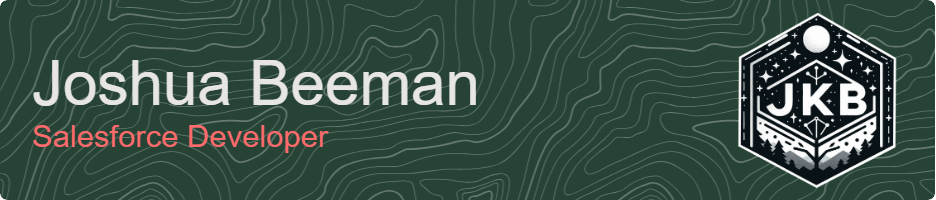

{}
# @JKBeeman-Pulmonx
I'm a relatively chill guy that loves the outdoors, video games, and cooking with friends.

If you want to talk or hangout, drop me a line below :arrow_double_down::arrow_double_down::arrow_double_down:

## :card_index: Contact
| Type | Information |
| ---- | ------------ |
| :office: Work | [650.216.0139](tel:6502160139) |
| :iphone: Mobile | [480.297.4138](tel:4802974138) |
| :e-mail: Email | [jbeeman@pulmonx.com](mailto:jbeeman@pulmonx.com) |
| :calendar: Calendar | [Book time with me](https://outlook.office.com/bookwithme/user/4868f413da3b42e689fcb2c4e516c132@pulmonx.com/meetingtype/SVRwCe7HMUGxuT6WGxi68g2?anonymous&ep=mlink)
| :briefcase: LinkedIn | [JoshuaBeeman](https://www.linkedin.com/in/joshuabeeman/) |
| :sunrise_over_mountains: Trailblazer | [@JKBeeman](https://trailblazer.me/id/jkbeeman) |
| :video_game: Xbox | [EliyahuYehoshua](https://account.xbox.com/Profile?Gamertag=EliyahuYehoshua) |

## :books: Specialties
I am a Salesforce Developer through and through, but I love building solutions that enhance Admin's capabilities in customizing Salesforce without needing a Dev to make all the changes.

I'm also working to build out a stable & scalable structure for SF Development across different teams & skill levels.
